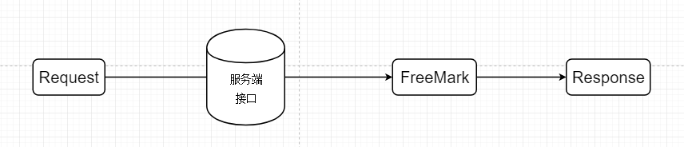
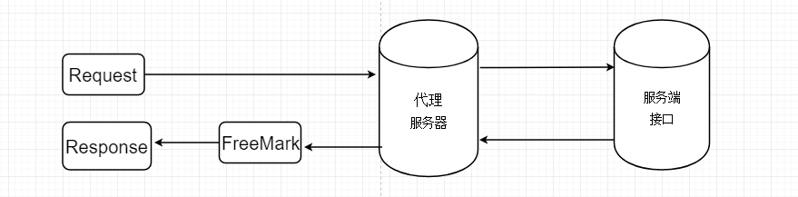
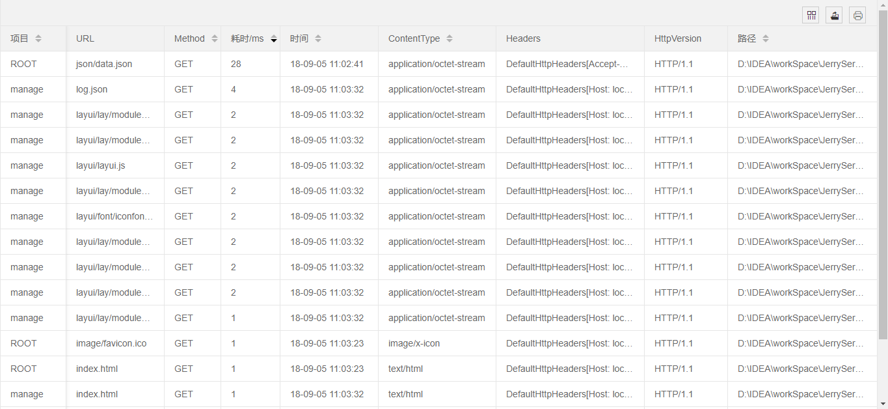
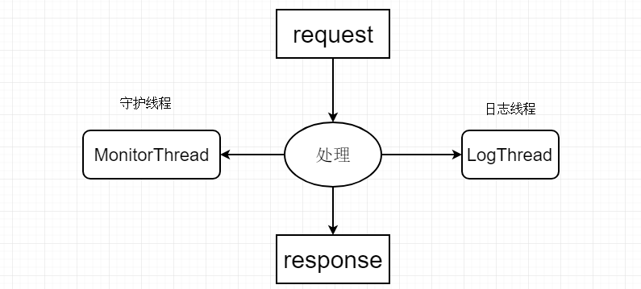
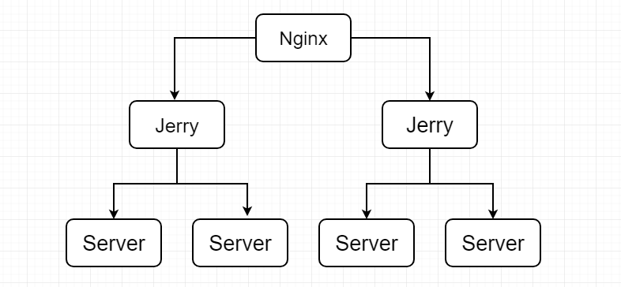

# Jerry Server - 正式版1.0.0 文档


## 1、缘由

以Java web举例，现在的网站系统开发模式，对于web端和服务端的数据交互以及页面渲染，无外乎两种：

1. 第一种是交给后端处理，Jsp，Freemark模板引擎之流，这种开发模式需要前端人员做好静态页面交给后端去处理一些其它工作。这种开发模式到如今也依旧流行，这也是招聘Java web程序员要求也要会HTML、JS、CSS的原因。到现在基本上都是采用这种开发模式，注意这种模式并非真正的前后端分离！
2. 另一种是交给前端处理，前端全部完成web端的页面渲染工作。要知道的是，前端处理只能使用JS，一些前端JS模板引擎也有不少，Vue等，无论再花哨，本质依旧是JS。不可忽视的是，完全依赖JS处理前端页面是存在弊端的，比如SEO问题。
3. 总的来说，两种方式有利有弊。如果你在实际开发中涉及到我上面说的第一种，需要后端再对前端页面进行处理，那么可以使用 Jerry 来解决这部分的分工，实现完全前后端分离。

## 2、定义

**Jerry是帮助前后端完全分离的工具，它可以帮助后端工程师只做后端，前端工程师只做前端。**

## 3、思想

简单来说，以往的模式是请求后端接口，后端进行处理后返回一个页面给浏览器。前后端并没有进行彻底分离，比如还在使用后端模板引擎（FreeMark，Thymeleaf）或JSP。为什么Web开发不能像Android等移动端开发一样真正前后端分离呢？

上述开发模式是后端提供接口（也就是网址），经过处理得到一些数据，然后经过模板引擎的一系列渲染，填充数据，再把完成的HTML页面返回给浏览器。流程图如下：



**Jerry 的思想就是把这部分的流程进行拆分。**流程图如下：



也许你会说，Cookie 怎么办？会话如何保持？我想说，Jerry 服务器会相当认真的执行代理的角色。把客户端的HTTP请求的方法、Cookie、参数原封不动的发送给服务端。服务端发送回来的响应也会把Set-Cookie响应给客户端。（笔者想到的就是Cookie比较常用，若思考欠缺，欢迎指正。）理论上说，Jerry的方案是可行的。

## 4、模式

1. 一种完全真正的前后端分离，Jerry采用如今最流行的JSON作为前后端数据交互的接口。

   对后端工程师来说，只需要关心接口的实现，不需要再接触前端页面，甚至不要求懂HTML，JS等。

2. 只做接口有什么优势？一套接口适用web、Android、ios各个平台，这对软件项目的可扩展性大大提升。不可否认的是，现在依旧有些网站采用后端直接返回html片段的开发模式，这对软件的扩展性非常不利。

3. 对前端工程师来说，任务脉络更为清晰而简洁。不像以前只需要做好页面，更需要使用FreeMark等处理动态交互。这在之前是由后端工程师来做的。可以说是完全颠覆以往。把网站开发做成像安卓开发一样的前后端分明。

4. 如果你已经有了成熟的前后端分离方案，自然不需要Jerry，如果你们的后端工程师还需要再去写FreeMark，Thymeleaf等，则可以考虑使用Jerry达到更彻底的前后端分离。

## 5、场景

你既可以把Jerry部署在实际项目中使用，当做一个前端服务器。

如果你真的不想在线上部署Jerry，那你可以在开发过程中，交由前端开发人员去使用Jerry。

把原来的前端只做静态页面然后交由后端去渲染的工作改为全部让前端去做，然后在上线时再把写过FreeMark语法的HTML文件放到后端项目中。


## 5、优势

1. 启动快！

   响应快，配置后台监控，响应时间一览无遗。

   优先读取各种文件的缓存，使用EhCache实现。

   对于后端接口，使用加权负载均衡。

   对于日志监控等耗时而且响应无关的操作，全部运行在其它线程。

   如果你还有其它加快速度的方法，欢迎留言。

2. 轻量级！没有过多依赖，能自己实现就自己写。全部依赖如下：

   - Netty
   - slf4j + logback
   - fastjson
   - ehcache
   - junit4
   - freemark

3. 自带监控系统。对页面的响应速度以及HTTP信息一览无遗。


## 6、引擎

Jerry 使用 FreeMark 作为模板引擎。也就是说，原来需要后端工程师使用freemark去渲染页面，现在变为前端工程师去使用。

例如，服务端接口：

```
{
	"message": "响应成功",
	"state": {
		"message": "ok",
	},
	"data": [{
		"time": "2018-04-25 13:25:07",
	}, {
		"time": "2018-04-25 13:25:07",
	}]

}
```
HTML页面：
```
    message：${message}<br>
    com: ${com}<br>
    data[0].time：${data[0].time}
```

其它用法请参考FreeMark学习网站：[FreeMark开发手册](http://freemarker.foofun.cn/)

## 7、监控

监控系统对各个页面与文件的响应耗时与请求信息进行监控，监控频率可以在全局配置文件中进行自定义配置，默认为10s。

对于监控日志可以自定义输出目录，目录只支持相对路径（也就是只能在webapps目录下），监控日志格式为JSON。

默认提供的监控页面位于webapps/manage项目下。默认访问：http://ip地址:8888/manage

后台监控页面预览：



监控系统运行流程：



## 8、负载均衡

Jerry 对于静态资源全部做了缓存，FreeMark本身就带有缓存。对于FreeMark页面的后端接口支持使用加权负载均衡。如果你想体验加权负载均衡，可以把缓存时间设置为1。然后不断刷新页面。关于如何设置负载均衡，请参考接口配置。

## 9、全局配置

全局配置文件位于config目录下，使用默认UTF-8编码进行读取。详细配置如下：

```
#开启端口
port=8888
#默认首页
index=index.html
#默认项目
project=ROOT
#全局404模板(webapps/)
404=/template/404.html
#接口配置文件名，要求内容为Json
config=page.json
#接口配置文件的编码
js_charset=UTF-8
#解析接口响应的编码
jk_charset=UTF-8
#请求接口超时时间ms
timeout=10000
#freemark文件编码
fm_charset=UTF-8
#监控刷新频率(毫秒/ms)
monitor=10000
#监控文件目录(webapps/)
monitorLog=/manage/log.json
#缓存:最大存储元素个数
maxElementsInMemory=10000
#缓存:最大发呆时间(秒/s)
timeToIdleSeconds=120
#缓存:最大存活时间(秒/s)
timeToLiveSeconds=600
#控制台日志级别INFO/DEBUG
level=INFO
```

Jerry把所有的web项目与页面都放在了webapps下，服务器也只会响应webapps目录下的文件。

1. 关于全局404模板，默认即可。不过也支持自定义。
2. 关于接口配置文件，默认page.json。你可以自定义，但一定必须是json内容，而且位于项目根目录下（如ROOT/page.json）。
3. 接口配置文件的编码就是page.json文件的读取时的编码格式。默认utf-8
4. freemark文件编码是设置处理freemark文件的编码。
5. 监控刷新频率。最低为1s，默认10s。
6. 上面缓存的意思是在有效的600秒(10分钟)内，如果连续120秒(2分钟)未访问缓存，则缓存失效。就算有访问，也只会存活600秒。
7. 当你想查看运行日志时，切换为debug即可。默认info。

## 10、接口配置

先看一下示范文件，下面进行讲解。

```
[
  {
    "page": "index.html",
    "id": "je",
    "inter": [
      {
        "link": "https://www.kuaidi100.com/query?type=shentong&postid=3374107234608&id=1",
        "weight": 1
      },
      {
        "link": "https://www.kuaidi100.com/query?type=yuantong&postid=801371015800473775&id=1",
        "weight": 2
      }
    ]
  },
  {
    "page": "admin/index.html",
    "id": "je",
    "inter": [
      {
        "link": "https://www.kuaidi100.com/query?type=shentong&postid=3374107234608&id=1",
        "weight": 1
      }
    ]
  }
]
```

| 属性   | 说明                                     |
| ------ | ---------------------------------------- |
| page   | HTML文件路径。                           |
| id     | ID名称。                                 |
| inter  | 后端接口对象，可以定义多个实现负载均衡。 |
| link   | 后端接口实际地址。                       |
| weight | 权重，用于负载均衡。                     |

在Jerry正式版中，采用FreeMark作为模板引擎，一个（FreeMark）HTML文件只能有一个配置。

## 12、一些其它问题

### 1，Linux与Windows

在Linux部署Jerry服务器，访问文件严格区分大小写。而在Windows对大小写不敏感。

举个例子，访问/ROOT和/ROOt时，在Windows是可以的，在Linux是失败的。

如果在使用中您还遇到了其它Bug，欢迎在我的Git或者博客给我留言。

### 2，关于编码

全项目默认UTF-8，不过也提供配置支持自定义。

对于不需要语法处理的HTML文件来说，不涉及编码问题。

对于需要语法处理的HTML文件，统一配置在config配置文件。

若出现乱码，请检查你的配置。

### 3，如何启动

请在Git克隆/下载本项目压缩包，解压后只需保留以下3个目录或文件，其它全部删除即可：

- /config
- /webapps
- JerryServer-0.0.1-SNAPSHOT.jar

然后在控制台或命令行执行`java -jar JerryServer-0.0.1-SNAPSHOT.jar`即可运行。

Linux系统如使其在后台运行，在末尾加个`&`即可。

然后使用的问题，一般来说，只需要把web项目放到webapps下，项目根目录新建page.json接口配置即可。
关于接口配置详细参数上面已经说明。然后在HTML页面使用FreeMark语法获取后端数据。例子：

API接口：
```
{
       "message": "ok",
       "data": [
           {
               "time": "2018-09-06 16:57:43",
           }
        ]
  }
```
HTML页面：
```
<p>
    message：${message}<br>
    data[0].time：${data[0].time}
</p>
```
### 4，是不是造Nginx的轮子

关于这一点很明确，不是。来看下面的流程图：



## 13、更新日志

2018/9/8：修复接口数据为数组解析失败的BUG。

2018/9/9：升级改版，主要是把接口配置简化。实行一个页面一个接口配置的策略。

把接口和页面进行绑定。访问页面的method、header和body就是请求接口的method、header和body。

支持GET请求，POST请求等。

关于请求体类型，除了 multipart/form-data 格式，binary二进制流（图片等），其余格式都支持。默认UTF-8解码与编码。

2018/9/10：去掉JSOUP依赖，使用HttpURLConnection进行网络请求。

## 14、尾声

### 禁止申请专利！

还有，感谢支持！

*若使用出现Bug等问题，请到以下地址留言评论，或者加入QQ群交流。*

我的博客：https://yueshutong.cnblogs.com/

Github：<https://github.com/yueshutong/JerryServer/> 

Gitee：<https://gitee.com/zyzpp/JerryServer>

开源中国：https://www.oschina.net/p/jerryserver


> 如果觉得还不错，请我喝杯茶吧！

