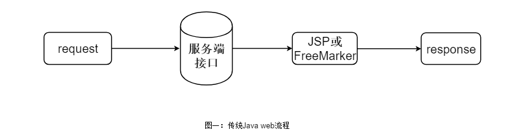
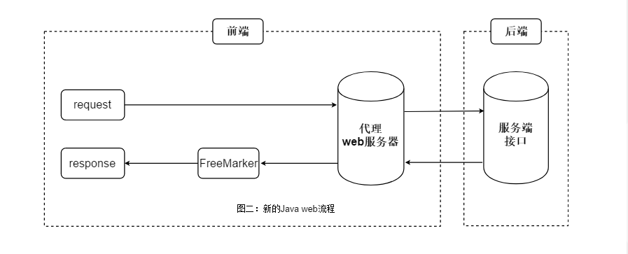

# Jerry Server - 正式版1.0.0 文档


如果你还不了解现在的前后端分离，推荐阅读淘宝前端团队的[前后端分离的思考与实践](http://taobaofed.org/blog/2014/04/05/practice-of-separation-of-front-end-from-back-end/)

## 1、问题

随着现在整个软件开发行业的发展，在开发模式上逐渐由以前的一个人完成服务端和前端web页面，演变为前端和后端逐渐分离的趋势。在安卓、IOS等移动设备开发基本已经成型，前后端达到了完全分离。可是在web网站开发中，前后端依旧高耦合、难分离；后端开发人员难以像开发安卓、IOS等移动端一样，只需要面向接口编程，而不用关心web页面的逻辑设计。

网站开发在前后端的分离上也进行了一部分发展，比如出现了Vue.js，React.js等前端js框架，使用起来可以说是很方便。但不可忽视的是，使用js去渲染页面是把压力转移到了客户端，而且使用js渲染页面会导致SEO（搜索引擎爬取不到页面信息）等问题。

所以，在服务端处理页面并返回视图也是现在另一种流行的开发模式。在Java web开发中，出现了JSP动态页面，动态渲染页面并返回视图到浏览器客户端。随着发展，JSP现如今也被FreeMarker、Thymeleaf等更加轻量的模板引擎逐渐取代，逐渐成为主流。但是这种方式造成了后端开发人员难以摆脱HTML页面，现在的公司依旧有很多后端工程师去做这部分工作。

综上所述，为了彻底解决上面的两个问题，既能实现前端与后端的完全分离，而又不需要使用js去渲染页面。我们在服务端处理页面的基础上发明了一种改变传统网站开发模式的web服务器，解决web开发中前后端难分离的问题。

本发明可以把后端人员对页面的处理的工作交还给前端去做。后端人员只需要面向接口编程，而不必接触前端HTML页面的实现。原来需要后端去写FreeMarker语法逻辑去渲染HTML页面的工作交由前端人员去做。本质上只是分离了这部分工作安排，而并没有改变工作的内容。


## 2、定义

Jerry服务器是类似Tomcat的web服务器，帮助前后端完全分离的工具，它可以帮助后端工程师只做后端，前端工程师只做前端。

## 3、技术效果

1. 前后端分工更加明确，后端只需要面向接口编程，只关心后端业务逻辑，不关心前端的实现。
2. 前端不再只写静态页面，还要使用FreeMarker语法写页面逻辑。
3. 后端的一套业务接口适用于安卓、IOS、web等平台设备，提高服务端系统的扩展性。
4. 改变了传统开发中要求后端人员必须学习HTML、JavaScript、Css等前端技能。
5. 本服务器可以用于开发过程中的调试阶段，由前端人员进行使用，并将最终写好逻辑的HTML文件放在项目中上线；也可以将本服务器直接用于线上环境，成为项目中的一部分。这两种都可以达到前后端分离开发的目的。

## 4、附图说明

图1：在传统Java web开发中的运行流程图

解释：此流程图中只有request部分是前端负责，其余均为后端负责。



图2：使用本发明之后的Java web运行流程图



## 5、安装使用

1. 前往Git仓库克隆/下载Zip压缩包到本地电脑。

2. 解压后只需保留以下3个目录或文件，其它全部删除即可：

   - /config
   - /webapps
   - JerryServer-1.0.0-SNAPSHOT.jar

3. 在控制台执行`java -jar JerryServer-1.0.0-SNAPSHOT.jar`命令运行该jar包。Linux系统如使其在后台运行，在末尾加个`&`即可。

4. 访问 <http://localhost:8888> 出现如下界面（默认访问ROOT项目的index.html文件）

   
   
   访问 <http://localhost:8888/admin> 体验动态渲染。
   
   

5. 安装成功！

## 6、模板引擎

Jerry 使用 FreeMarker 作为模板引擎。

例如，服务端接口：

```
{
	"message": "响应成功",
	"state": {
		"message": "ok",
	},
	"data": [{
		"time": "2018-04-25 13:25:07",
	}, {
		"time": "2018-04-25 13:25:07",
	}]

}
```
HTML页面：
```
    message：${message}<br>
    com: ${com}<br>
    data[0].time：${data[0].time}
```

其它用法请参考FreeMarker学习网站：[FreeMarker开发手册](http://FreeMarkerer.foofun.cn/)

## 7、后台监控

监控系统对各个页面与文件的响应耗时与请求信息进行监控，监控频率可以在全局配置文件中进行自定义配置，默认为10s。

对于监控日志可以自定义输出目录，目录只支持相对路径（也就是只能在webapps目录下），监控日志格式为JSON。

默认提供的监控页面位于webapps/manage项目下。默认访问：http://localhost:8888/manage

后台监控页面预览：


## 8、负载均衡

对于FreeMarker页面的后端接口支持使用加权负载均衡。关于如何设置负载均衡，请参考接口配置。

## 9、全局配置

全局配置文件位于config目录下，使用默认UTF-8编码进行读取。详细配置如下：

```
#开启端口
port=8888
#默认首页
index=index.html
#默认项目
project=ROOT
#全局404模板(webapps/)
404=/template/404.html
#接口配置文件名，要求内容为Json
config=page.json
#接口配置文件的编码
js_charset=UTF-8
#解析接口响应的编码
jk_charset=UTF-8
#请求接口超时时间ms
timeout=10000
#FreeMarker文件编码
fm_charset=UTF-8
#监控刷新频率(毫秒/ms)
monitor=10000
#监控文件目录(webapps/)
monitorLog=/manage/log.json
#缓存:最大存储元素个数
maxElementsInMemory=10000
#缓存:最大发呆时间(秒/s)
timeToIdleSeconds=120
#缓存:最大存活时间(秒/s)
timeToLiveSeconds=600
#控制台日志级别INFO/DEBUG
level=INFO
```

Jerry把所有的web项目与页面都放在了webapps下，服务器也只会响应webapps目录下的文件。

1. 关于全局404模板，默认即可。不过也支持自定义。
2. 关于接口配置文件，默认page.json。你可以自定义，但一定必须是json内容，而且位于项目根目录下（如ROOT/page.json）。
3. 接口配置文件的编码就是page.json文件的读取时的编码格式。默认utf-8
4. FreeMarker文件编码是设置处理FreeMarker文件的编码。
5. 监控刷新频率。最低为1s，默认10s。
6. 上面缓存的意思是在有效的600秒(10分钟)内，如果连续120秒(2分钟)未访问缓存，则缓存失效。就算有访问，也只会存活600秒。
7. 当你想查看运行日志时，切换为debug即可。默认info。

## 10、接口配置

先看一下示范文件，下面进行讲解。

```
[
  {
    "page": "index.html",
    "id": "je",
    "inter": [
      {
        "link": "https://www.kuaidi100.com/query?type=shentong&postid=3374107234608&id=1",
        "weight": 1
      },
      {
        "link": "https://www.kuaidi100.com/query?type=yuantong&postid=801371015800473775&id=1",
        "weight": 2
      }
    ]
  },
  {
    "page": "admin/index.html",
    "id": "je",
    "inter": [
      {
        "link": "https://www.kuaidi100.com/query?type=shentong&postid=3374107234608&id=1",
        "weight": 1
      }
    ]
  }
]
```

| 属性   | 说明                                     |
| ------ | ---------------------------------------- |
| page   | HTML文件路径。                           |
| id     | ID名称。                                 |
| inter  | 后端接口对象，可以定义多个实现负载均衡。 |
| link   | 后端接口实际地址。                       |
| weight | 权重，用于负载均衡。                     |

在Jerry正式版中，采用FreeMarker作为模板引擎，一个（FreeMarker）HTML文件只能有一个配置。

## 11、一些其它问题

### 1，Linux与Windows

在Linux部署Jerry服务器，访问文件严格区分大小写。而在Windows对大小写不敏感。

举个例子，访问/ROOT和/ROOt时，在Windows是可以的，在Linux是失败的。

如果在使用中您还遇到了其它Bug，欢迎在我的Git或者博客给我留言。

### 2，关于编码

全项目默认UTF-8，不过也提供配置支持自定义。

对于不需要语法处理的HTML文件来说，不涉及编码问题。

对于需要语法处理的HTML文件，统一配置在config配置文件。

若出现乱码，请检查你的配置。

### 3，是不是造Node.Js的轮子

关于Node.Js，在做这个的时候我真的不知道它是干啥的。因为我是一名Java后端工程师。

现在了解了Node.Js后，感觉Node.Js和我的这个web服务器的角色都是中间的代理服务器，从两者渲染HTML页面的方式上来看，本质还是不同的。Node.Js使用的JS进行编程式渲染，需要写代码逻辑，我的web服务器使用的FreeMarker模板引擎，直接在HTML上写表达式语法，相比较之下，我的web服务器更简单，更方便。非但如此，JerryServer服务器更符合服务拆分的思想。NodeJs虽然起到了前后端分离的作用，但也加大了前端人员的业务需求，许多后端的业务从此转为了前端。JerryServer轻量简单可分布式扩展，如何选择，还需要根据实际情况判断。

## 12、更新日志

2018/9/8：修复接口数据为数组解析失败的BUG。

2018/9/9：升级改版，主要是把接口配置简化。实行一个页面一个接口配置的策略。

把接口和页面进行绑定。访问页面的method、header和body就是请求接口的method、header和body。

支持GET请求，POST请求等。

关于请求体类型，除了 multipart/form-data 格式，binary二进制流（图片等），其余格式都支持。默认UTF-8解码与编码。

2018/9/10：去掉JSOUP依赖，使用HttpURLConnection进行网络请求。

2018/9/18：修复URL路径问题，访问目录默认访问目录下index.html（可自定义）

2018/9/21: 改用线程池管理日志线程

## 13、尾声

### 禁止申请专利！

Email：[yster@foxmail.com](mailto:yster@foxmail.com)

如果帮助到你了，请不吝赞赏！谢谢！


